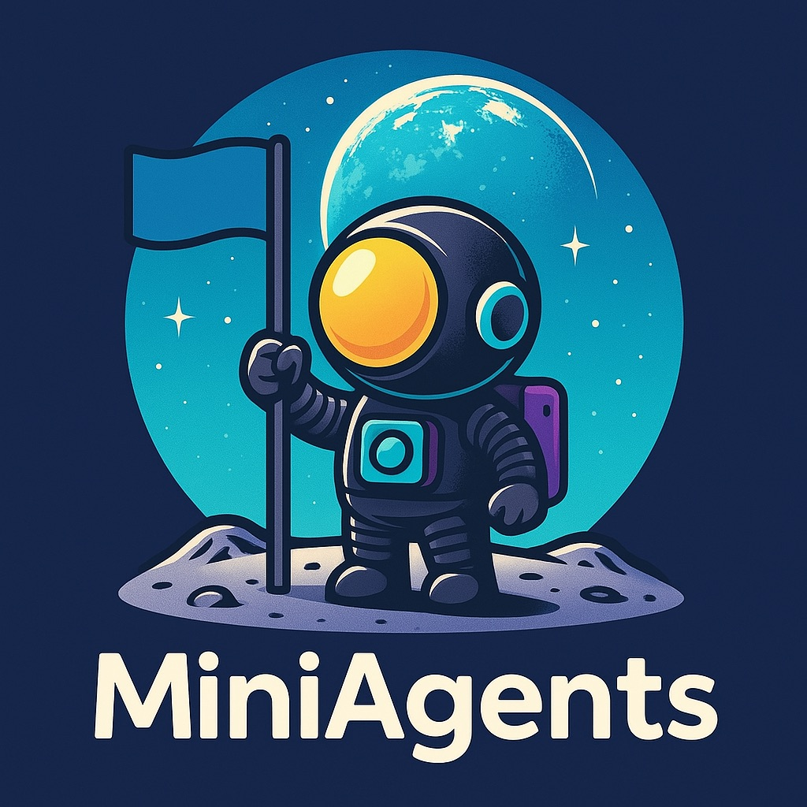

***NOTE: The [web_research.py](web_research.py) file contains exhaustive commentary, we advise you to read it if you want to understand the system in detail (and get a good feel of the framework).***

# WebResearch

A demonstration of the [MiniAgents](https://github.com/teremterem/MiniAgents) framework showcasing an AI-powered web research system.

## Overview

WebResearch is a multi-agent system that:

1. Breaks down a user's question into search queries
2. Executes searches in parallel
3. Analyzes search results to identify relevant web pages
4. Scrapes and extracts information from those pages
5. Synthesizes a comprehensive answer

All built with procedural code simplicity while benefiting from MiniAgents' automatic parallelism.

## How It Works

This system demonstrates two key strengths of MiniAgents:

### 1. Message Sequence Promises

Every interaction between agents happens through message sequence promises:

- `web_search_agent.trigger()` returns promises, not actual results
- The final synthesis waits for the promises to be resolved

### 2. Non-blocking Parallelism

The system exhibits incredible parallelism with no special code:

- Multiple search queries are processed simultaneously
- Multiple web pages are scraped in parallel
- All without explicit thread or process management

MiniAgents uses the `start_soon` mode by default, allowing each agent to run in the background. The immutable message design ensures this parallelism is safe and efficient.

## Installation

```bash
pip install -U -r requirements.txt
```

## Configuration

For the LLM we use [OpenAI](https://platform.openai.com/api-keys), for google searches we use [Bright Data SERP API](https://brightdata.com/products/serp-api) and for scraping we use [Bright Data Scraping Browser](https://brightdata.com/products/scraping-browser). All are pay as you go services.

The websites referenced above will walk you through the process of setting respective products up and getting your API keys. After that you are ready to create a `.env` file with your API credentials:

```
OPENAI_API_KEY=your_openai_api_key
BRIGHTDATA_SERP_API_CREDS=username:password
BRIGHTDATA_SCRAPING_BROWSER_CREDS=username:password
```

***NOTE: The credentials are specifically for Bright Data's SERP API and Scraping Browser products, not for your whole Bright Data account.***

## Usage

```bash
python web_research.py
```

Then enter your research question when prompted.

Example question:
```
I'm thinking of moving from Lviv to Kyiv — what should I know about the cost of living, neighborhoods, gyms, and, most importantly, finding an apartment if I have two cats?
```

## Architecture

The system consists of three main agents:

1. **Research Agent**: Coordinates the workflow, breaks down questions into search queries
2. **Web Search Agent**: Executes searches and identifies relevant web pages
3. **Page Scraper Agent**: Extracts information from web pages
4. **Final Answer Agent**: Synthesizes the final answer

All agents communicate asynchronously through MiniAgents' promise-based architecture.

## About MiniAgents

MiniAgents is an open-source, async-first Python framework for building multi-agent AI systems with an innovative approach to parallelism. Key advantages:

1. **Write procedural code, get parallel execution**: Unlike graph-based frameworks, MiniAgents lets you write straightforward sequential code.
2. **Nothing blocks until it's needed**: With its promise-based architecture, agents execute in parallel and execution blocks only at points where specific agent messages are required.
3. **Immutable message philosophy**: Uses immutable, Pydantic-based messages that eliminate race conditions and data corruption concerns.

Learn more: [MiniAgents GitHub Repository](https://github.com/teremterem/MiniAgents)

<p align="center">
    <a href="https://github.com/teremterem/MiniAgents">
        
    </a>
</p>
